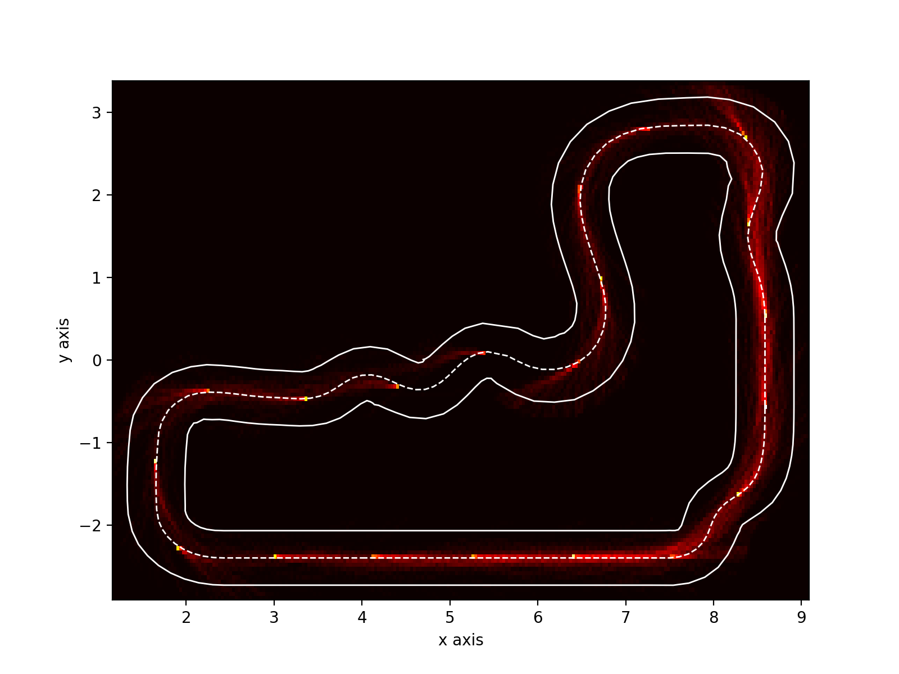

# Deep Racer Heatmap
## Add logging to model
Add the following input parameters to your model if you don't already have them

```python
closest_waypoints = params['closest_waypoints']
track_width = params['track_width']
steering_angle = params['steering_angle']
steps = params['steps']
```

Then add the following at the end of your model, it will add the extra logging required to generate the circuit layout on the heatmap

```python
import math 
coord0 = waypoints[closest_waypoints[0]]
coord1 = waypoints[closest_waypoints[1]]
myradians = math.atan2(coord1[1]-coord0[1], coord1[0]-coord0[0]) #(y,x i.e opposite/adjacent)
mydegrees = math.degrees(myradians)
print("Waypoint0:{},X:{},Y:{},heading:{},trackwidth:{},steeringangle:{},steps:{}".format(closest_waypoints[0],coord0[0],coord0[1],mydegrees,track_width,steering_angle,steps))
```

## Python Modules
Install [matplotlib](https://matplotlib.org/3.1.0/faq/installing_faq.html) 
```bash
pip3 install matplotlib
```

## Usage
After training your model with the additional logging added find the name of the log stream that was created for this model, it should be the latest logstream in CloudWatch Logs /aws/robomaker/SimulationJobs e.g. "sim-nd2x4c3ph1d3/2019-06-05T14-39-30.940Z_3f5ddea9-6535-45d0-b1c7-ceb4b054f884/SimulationApplicationLogs"

Now generate a heatmap by running the script
```bash
python3 Get-DeepRacerHeatMap.py --profile <yourprofile> --logstreamname sim-nd2x4c3ph1d3/2019-06-05T14-39-30.940Z_3f5ddea9-6535-45d0-b1c7-ceb4b054f884/SimulationApplicationLogs
```




